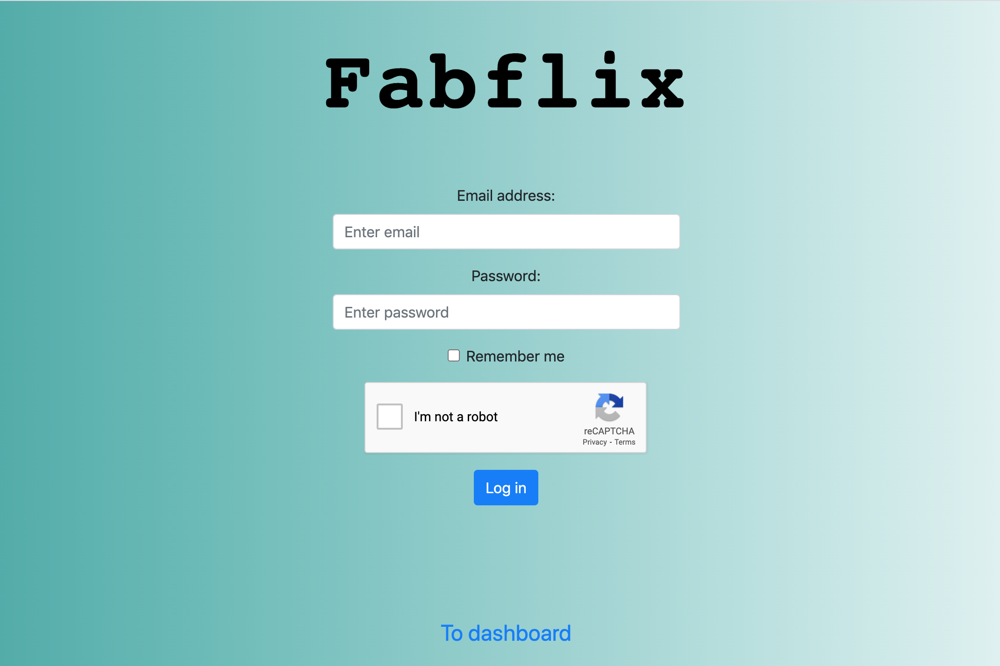
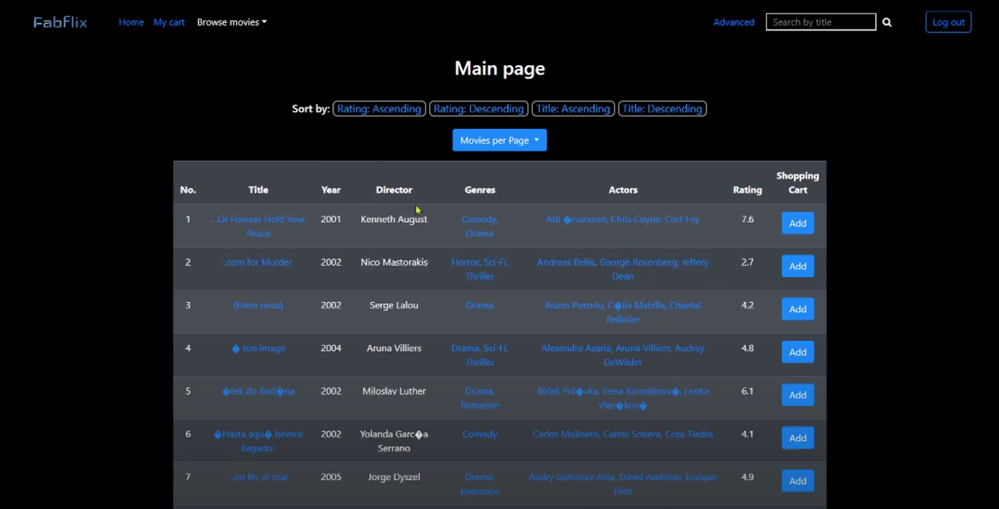
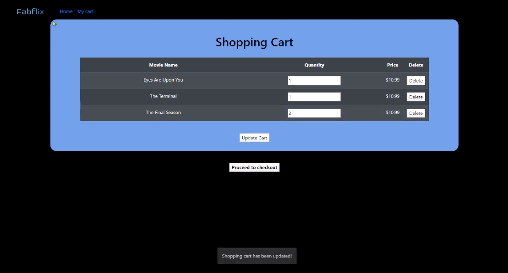
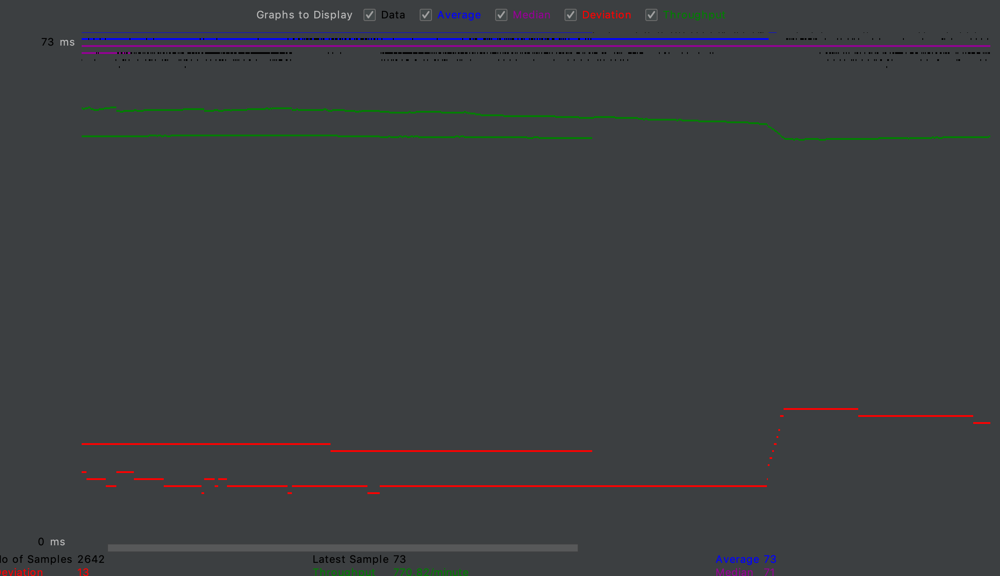
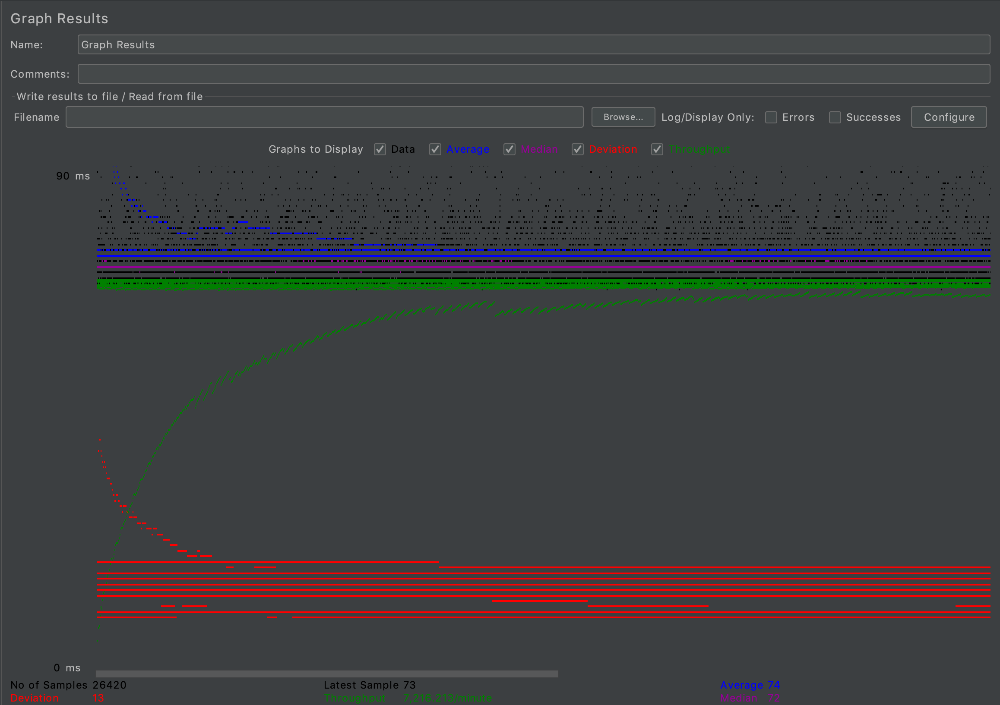
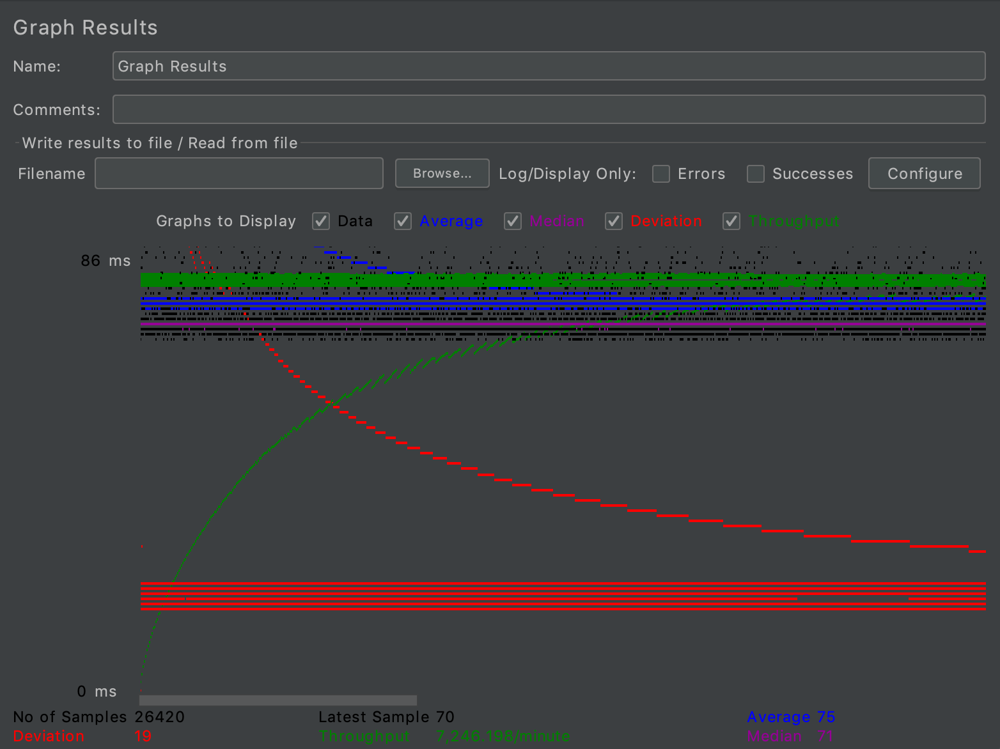
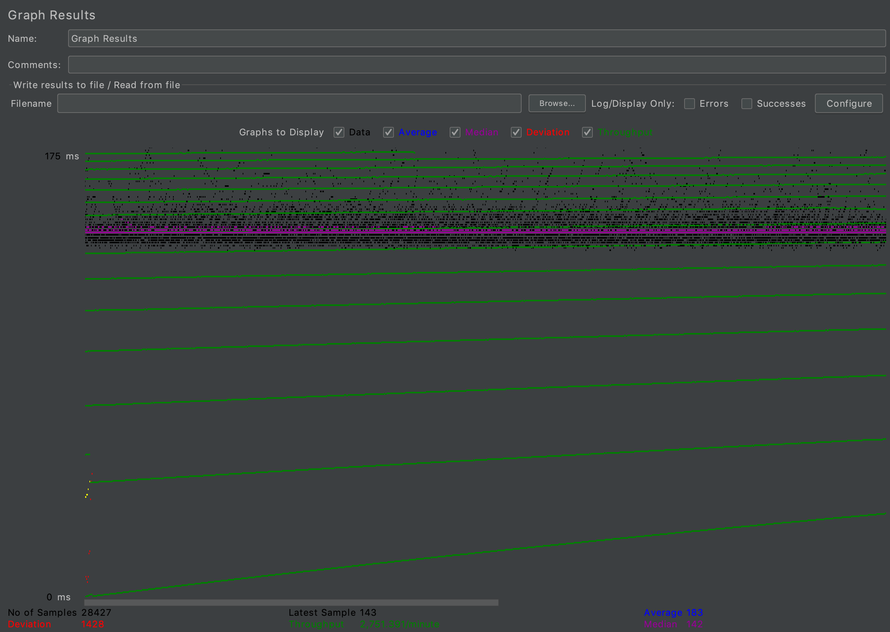
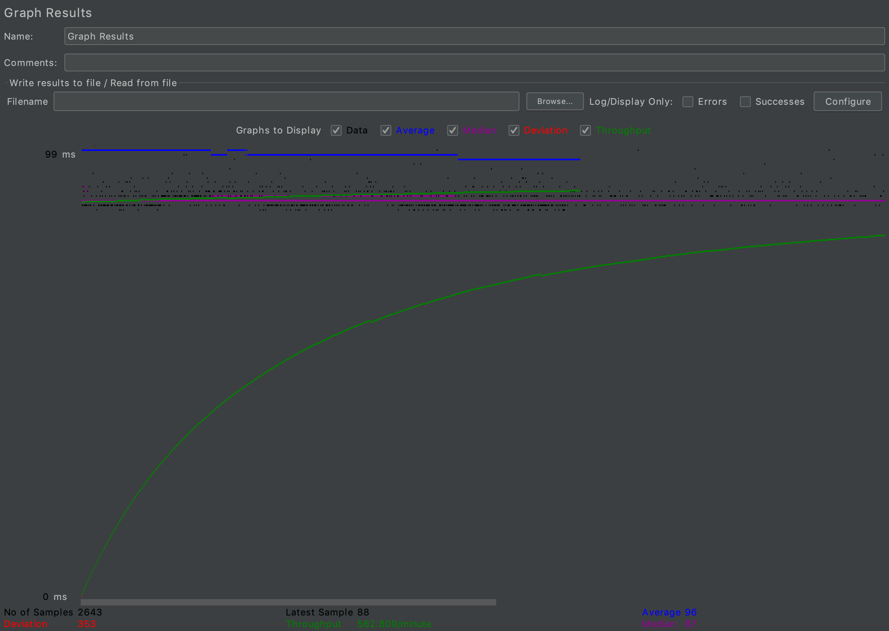
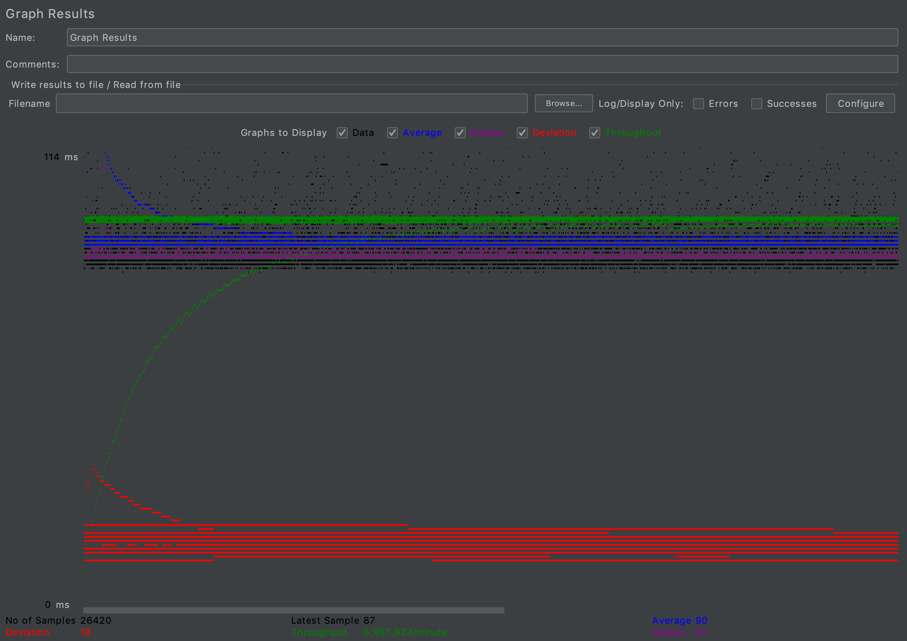
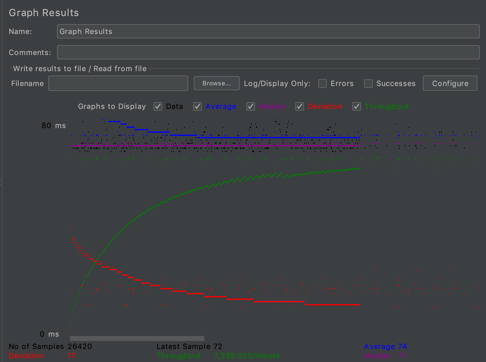

# Movie Platform Fabflix
  

Copyright (c) <2020>, < felicityzhao99 >
All rights reserved. Any copy would not be allowed, or will be reported as plagiarism. 

## Demo Setting Steps
The steps we will introduce are about how to deploy the web app on AWS instance.

Note: mysql file on github is called createtable.sql, not create_table.sql.

Step zero:

Don't forget to store movie-data.sql under /home/ubuntu. Build database on AWS MySQL.

Step one:
```$xslt
   git clone https://github.com/felicityzhao99/Movie-Platform.git
```
Step two:

> Inside your repo, where the pom.xml file locates, build the war file:
```
   mvn package
```
> Show tomcat web apps, it should NOT have the war file yet:
```$xslt
   ls -lah /home/ubuntu/tomcat/webapps
```
> Copy your newly built war file:
```$xslt
   cp ./target/*.war /home/ubuntu/tomcat/webapps
```
> Show tomcat web apps, it should now have the new war file:
```$xslt
   ls -lah /home/ubuntu/tomcat/webapps
```
Step three:

1. refresh the tomcat manager page. You should see a new project (just deployed): project 1.
2. click the project link, which goes to your website's landing page.
3. after click the Movies hyperlink, navigate to Movie List Page. Scroll up and down to show all 20 movies if needed.
4. on Movie List Page, click on a movie title hyperlink. Should jump to Single Movie Page; click on a star name hyperlink. Should jump to Single Star Page.
5. on Single Movie Page, click on a star name hyperlink. Should jump to Single Star Page. Show all information on Single Star Page. Click back button. Should jump to Movie List Page.
6. on Single Star Page, click on a movie name hyperlink. Should jump to Single Movie Page. Show all information on Single Movie Page. Click back button. Should jump to Movie List Page.

Step four (OPTIONAL):
- If you want to test the android mobile, after you git clone the project, make sure you import it from the folder called "fabflix_mobile" in intellij.
Don't import the folder called "", or else you won't successfully
run the android gradle.

Congratulation! You're done!

# Video Links
For those who are interested in our demo, please check this video link:

Project 1: https://www.youtube.com/watch?v=f_nbnUMRR6Q

Project 2: https://www.youtube.com/watch?v=8Ld7Ztijew0&feature=youtu.be

Project 3: https://www.youtube.com/watch?v=zlWNZbClFMs&feature=youtu.be

Project 4: https://youtu.be/rkUvfTvAilo

Project 5: https://youtu.be/A9qPu0foIKk

## Notice in this project
- ### Connection Pooling
    - #### Files using JDBC Connection Pooling:
        - Configuration: fabflix/WebContent/META-INF/context.xml
        - fabflix/src/ActorServlet (PreparedStatement)
        - fabflix/src/AutoCompleteServlet (PreparedStatement)
        - fabflix/src/BrowseServlet
        - fabflix/src/cart2Servlet
        - fabflix/src/GenreServlet
        - fabflix/src/InsertMovieServlet (PreparedStatement, masterdb)
        - fabflix/src/Login2Servlet (PreparedStatement)
        - fabflix/src/LoginServlet (PreparedStatement)
        - fabflix/src/mobileLoginServlet (PreparedStatement)
        - fabflix/src/MovieServlet (PreparedStatement)
        - fabflix/src/PaymentServlet (PreparedStatement, masterdb)
        - fabflix/src/SearchServlet (PreparedStatement)
        - fabflix/src/StarServlet (PreparedStatement, masterdb)
    
    - #### How Connection Pooling is utilized in the Fabflix code
        - All servlets first obtain an environment context and then lease a connection from the JDBC connection pool
        - When done, servlets return the connection back to the pool so that it can be reused
        - Use PreparedStatement to handle queries that involve user inputs, such as LoginServlet, SearchServlet, and etc
    
    - #### How Connection Pooling works with two backend SQL.
        - Use a different connection pool for each backend database (masterdb and localhost, two pools)
        - Each servlet leases a connection from one of the pools, depending on its purpose => if read only,
        use localhost; otherwise, use masterdb
        
 - ### Master/Slave
     - #### Include the filename/path of all code/configuration files of routing queries to Master/Slave SQL.
        - See configuration: fabflix/WebContent/META-INF/context.xml
     - #### How read/write requests were routed to Master/Slave SQL?
        - See above section, files using masterdb involve write operation to SQL
        - For those involve write operations, lease connection from the masterdb pool
        - For those only involves read, lease connection from localhost pool (does not matter if it is master or slave)
    
- ### JMeter TS/TJ Time Logs
    - #### Instructions of how to use the `log_processing.*` script to process the JMeter logs.
    - It will run as a separate Java program, whose main function involves reading our search log file
    from location "contextPath+"\\search_log.txt". It iterates
    over the log file line by line, and calculates TS/TJ average.
    - Output to contextPath+"\\average.txt"

- ### JMeter TS/TJ Time Measurement Report
    - #### Since our group didn't get all the correct movie parsing data, we used what we have now to do the research below.
| **Single-instance Version Test Plan**          | **Graph Results Screenshot** | **Average Query Time(ms)** | **Average Search Servlet Time(ms)** | **Average JDBC Time(ms)** |
|------------------------------------------------|------------------------------|----------------------------|-------------------------------------|---------------------------|
| Case 1: HTTP/1 thread                          |  | 73                         | 1990979                             | 1860377                   | 
| Case 2: HTTP/10 threads                        | | 74                         | 3288622                             | 3222175                   |
| Case 3: HTTPS/10 threads                       |                             | 75                         | 3392441                                  | 3306220                        | 
| Case 4: HTTP/10 threads/No connection pooling  |   | 183           | 2830335                             | 2755021                   | 

| **Scaled Version Test Plan**                   | **Graph Results Screenshot** | **Average Query Time(ms)** | **Average Search Servlet Time(ms)** | **Average JDBC Time(ms)** | 
|------------------------------------------------|------------------------------|----------------------------|-------------------------------------|---------------------------|
| Case 1: HTTP/1 thread                          |    | 96                         | 2455599                                  | 2358905                        | 
| Case 2: HTTP/10 threads                        |   | 90                         | 3062800                                  | 2999209                       | 
| Case 3: HTTP/10 threads/No connection pooling  |                              | 75                         | -                                  | -                       | 

Analysis: TS is always greater than TJ. Also, HTTP 1 thread's avg query time is similar as HTTP 10 thread's avg query time.
Avg query time of no Connection Pooling is larger than connection pooling one. 


- ### Prepared Statement files (go to src files)
    - ActorServlet
    - BrowseServlet
    - cart2Servlet
    - GenreServlet
    - LoginServlet
    - MovieServlet
    - MoviesServlet
    - SearchServlet
    
- We compared the Normal vs. Branch vs. Load

  15min vs. 162562(milliseconds) vs. 2650 milliseconds

- ### Clarification on SQL 'like' predicate
    We generate our sql query based on search box & advanced search form inputs.

    The javascript function is in movieList.js, and the actual query is formed in SearchServlet.java

    For title, director, and actor input, we use this syntax: ... where title like '%title%'.

    For year input, we use a stricter syntax: ... where year = 'year'.
    
- ### Substring Matching Design
  Should support "substring matching" so that customers do not have to provide an exact value for an attribute. For example, if search by title keyword: "term", movies such as "Terminal" and "Terminator" should be returned.
  
  Only String (VARCHAR) fields are required to support substring matching. Thus, year should not support it.
  
  You can use the "LIKE" and "ILIKE" SQL operators for pattern matching in any way you wish. 
  
  Customer input should just be keywords. Should NOT expect customer input to have any wildcards characters.
  
  Our team uses LIKE/ILIKE in search feature. 

## Contents
Movie List Page:

The Movie list Page shows movies in specific order. You don't need to show all the movies. Each movie needs to contain the following information:
- title
- year
- director
- first three genres
- first three stars
- rating

Single Movie Page:

From Movie List Page or Single Star Page, if the user clicks on a movie (hyperlinked), the corresponding Single Movie page displays all the information about the movie, including:
- title
- year
- director
- all of the genres
- all of the stars 
- rating

Single Star Page:

From Movie List Page or Single Movie Page, if the user clicks on a star (hyperlinked), the corresponding Single Star Page displays all the information about this star, including:
- name
- year of birth (N/A if not available)
- all  movies (hyperlinked) in which the star acted


